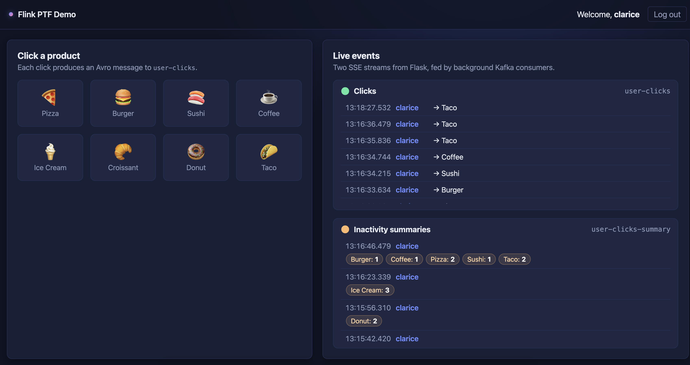

# Flink PTF Demo: Click Inactivity Detection on Confluent Cloud

A self-contained web demo of **Confluent Cloud for Apache Flink Process Table Functions (PTFs)**.

A user logs in, clicks product tiles, and watches in real time:
1. Click events being produced to Kafka (`user-clicks` topic, Avro).
2. The PTF-generated **inactivity summary** (`user-clicks-summary` topic, Avro), emitted **10 seconds after the user's last click**, with an aggregated per-product click count.

All Confluent Cloud resources (environment, Kafka Basic cluster in AWS `us-east-1`, Flink compute pool, service account, RBAC, API keys, topics, schemas, the PTF artifact upload, and `CREATE FUNCTION` + `INSERT INTO` Flink statements) are provisioned via **Terraform**.

## Architecture

```
[React UI]  ──[Click]─>  Flask API  ──[AVRO Produce]─>  Kafka: user-clicks
   ▲                        │                                   │
   │                        ▼                                   ▼
   │                  SSE consumer                    Flink PTF (per-user state,
   │                   (2 topics)                  10s event-time inactivity timer)
   │                        ▲                                   │
   │                        │                                   ▼
   └──────── SSE Stream ────┘   <─[AVRO Consumer]──  Kafka: user-clicks-summary
```

## What This Demo Does

Users log in and click on product tiles (Pizza, Burger, Sushi, etc.). Each click produces an Avro event to the `user-clicks` Kafka topic. The Flink PTF maintains per-user state, tracking how many times each product was clicked. When a user stops clicking for 10 seconds (event-time inactivity), the PTF fires a timer and emits a summary to the `user-clicks-summary` topic showing the breakdown of clicks per product (e.g., "Pizza: 3, Burger: 1"). The summary appears in the UI, and the state is cleared so the next burst of clicks starts fresh. This demonstrates how PTFs can detect the *absence* of activity and generate meaningful events from silence—a pattern applicable to abandoned carts, idle sessions, SLA breaches, and more.



## Why PTFs matter

Classic stream processing is purely **reactive** — an operator only runs when an event arrives. If nothing happens, nothing happens. That makes a whole class of real-world problems awkward to express, because they're defined by the **absence** of an event, not its presence:

- **Abandoned carts** — a shopper added items but never checked out
- **SLA breaches** — a response never came back within 30 s
- **Idle sessions** — no activity for 10 minutes; time to log the user out
- **Silent devices** — an IoT sensor hasn't reported in for an hour
- **Stuck workflows** — a payment was authorised but never captured

PTFs change that. Alongside the usual "react to an input row," a PTF can **schedule a future trigger** via an event-time or processing-time timer. When that timer fires, the PTF emits its own event — a new fact in the stream that downstream consumers can act on, alert on, or join with other data.

In short: **PTFs let your stream generate events from silence.** That's the difference between knowing *"the user clicked Pizza"* and knowing *"the user stopped clicking."* Both are valuable. Only one is reachable with plain stateful operators.

This demo's `ClickInactivitySummary` is a tiny example of the pattern — the same shape solves cart-abandonment, SLA breach, idle-session, and silent-device problems.

### Watermark Advancement and the Heartbeat Pattern

Event-time timers in PTFs depend on **watermarks** to advance. A watermark is Flink's way of saying "I've seen all events up to time T." When the watermark passes a scheduled timer's timestamp, the timer fires and `onTimer(...)` is called.

**The problem:** If a Kafka partition stops receiving events, its watermark stalls. Your PTF's timer never fires, even if 10 real-world seconds have passed, because event time hasn't advanced. This is especially problematic for inactivity detection—the very scenario where events *stop* arriving is when you need the timer to trigger.

**Why not wall-clock threads?** You might think: "Just spawn a Java thread per user and sleep for 10 seconds." This doesn't scale. With thousands or millions of users, you'd have thousands or millions of threads, each consuming memory and CPU for context switching. Worse, threads don't integrate with Flink's checkpointing, watermarking, or state management—you'd be fighting the framework instead of using it.

**The solution: Heartbeats per partition.** For low traffic / slow moving partitions, emit a lightweight heartbeat event (e.g., every 0.5–1 second) to each Kafka partition. The heartbeat doesn't need meaningful payload, in this example, just a valid `click_ts` timestamp that keeps advancing. This keeps the watermark moving forward, so per-user timers can fire as expected when their inactivity window elapses.

**Why per partition, not per key?** Watermarks are computed **per partition** and then aggregated across partitions. You don't need a heartbeat for every user—just one heartbeat stream per partition (or per Flink bucket if mapped 1:1). With a single partition, a single heartbeat stream is sufficient and efficient.

**Efficiency:** A small heartbeat rate (e.g., 1 Hz) is negligible overhead compared to the complexity and resource cost of managing native threads per key. It's a valid pattern for production-scale inactivity detection.

**Example heartbeat payload:**
```json
key = "heartbeat"  # nake sure to be a value that will hash to the partition you want
value = {
  "user_id": null,
  "product_id": null,
  "product_name": null,
  "click_ts": 1750713480000
}
```
The payload content is irrelevant—only `click_ts` matters for watermark advancement. The schema must be valid Avro, but the values can be minimal placeholders.

## Prerequisites

- A [Confluent Cloud](https://confluent.cloud/signup) account with a [**Cloud API key/secret**](https://docs.confluent.io/cloud/current/security/authenticate/workload-identities/service-accounts/api-keys/manage-api-keys.html#add-an-api-key) (organization-level, not Kafka-level)
- [Terraform](https://developer.hashicorp.com/terraform/install) `>= 1.5`
- [Java](https://adoptium.net/) `11+` and [Maven](https://maven.apache.org/install.html) `3.8+` (for building the PTF JAR)
- [Python](https://www.python.org/downloads/) `3.10+` (for the Flask backend; also serves the static React UI — no Node/npm required)

> ⚠️ **PTFs are an Early Access feature on Confluent Cloud for Apache Flink.**
> Before running `terraform apply`, the **Process Table Functions** Early Access program
> must be enabled for your Confluent Cloud organization (and, depending on the sub-feature,
> the **PTF timer service** may need to be enabled separately — required for this demo's
> inactivity-detection PTF).
> If it isn't, `terraform apply` will fail on the `CREATE FUNCTION` statement.
> See [Process Table Functions — Confluent Cloud docs](https://docs.confluent.io/cloud/current/flink/concepts/process-table-functions.html)
> and contact Confluent support or your account team to request enablement.

## Quickstart

### Using the automated scripts (recommended)

```bash
# 1) Configure Confluent Cloud credentials
cp terraform/.env.example terraform/.env
# Edit terraform/.env with your Confluent Cloud API key/secret (organization-level)

# 2) Start the demo (builds JAR, provisions resources, starts backend)
./start.sh
# Opens http://localhost:5001 — Press [CTRL]-C to stop the backend

# 3) Tear down when done
./stop.sh
```

### Manual step-by-step (alternative)

<details>
<summary>Click to expand manual instructions</summary>

```bash
# 1) Build the PTF JAR — Terraform reads it from flink-ptf/target/
cd flink-ptf && mvn -q clean package && cd ..

# 2) Provision Confluent Cloud (creates env, cluster, SR, topics, schemas,
#    compute pool, uploads JAR, registers PTF, starts INSERT INTO statement)
cd terraform
cp .env.example .env     # Update .env with the Confluent Cloud credentials (organization-level, not Kafka-level)
source .env
terraform init
terraform plan           # Check everything's ok
terraform apply          # ~5 minutes; writes ../backend/.env on success
cd ..

# 3) Start the backend (it serves the UI too, at http://localhost:5001)
cd backend
python3 -m venv .venv
source .venv/bin/activate
pip install -r requirements.txt
flask --app app run -p 5001  # Press [CTRL]-C to stop it

# 4) Tear it down when done
cd ..
cd terraform && terraform destroy
```

</details>

## How the PTF works

The PTF (`flink-ptf/src/main/java/io/confluent/demo/ptf/ClickInactivitySummary.java`)
extends `ProcessTableFunction<Row>` and uses:

- `@StateHint` for per-user managed state (a `Map<product_id, ProductCount>`).
- `@ArgumentHint({SET_SEMANTIC_TABLE, REQUIRE_ON_TIME})` so Flink partitions input by `user_id` and provides event-time semantics.
- A **named** event-time timer `"inactivity"` re-registered on every click — re-using the same name resets it.
- `ctx.clearAllState()` after emitting, so each inactivity burst is independent.

It's registered with `CREATE FUNCTION inactivity_summary AS '…' USING JAR 'confluent-artifact://…'` and invoked from SQL:

```sql
INSERT INTO `user-clicks-summary`
SELECT CAST(user_id AS BYTES) AS key, detected_at, click_counts
FROM inactivity_summary(
  input        => TABLE `user-clicks` PARTITION BY user_id,
  timeout_secs => 10,
  on_time      => DESCRIPTOR(`$rowtime`),
  uid          => 'inactivity-summary-v1'
);
```

## Verification

1. Open `http://localhost:5001`, log in as `clarice`, click 🍕 ×3 and 🍔 ×1 — the "Clicks" panel updates within ~1 s each.
2. Stop clicking. After ~10 s of inactivity (plus a few seconds for watermark advance), the "Summaries" panel shows `clarice: Pizza×3, Burger×1`.
3. Click 🍣 once, wait — next summary contains only `Sushi×1`, proving `clearAllState()` ran.
4. Open a second browser as `bob` — bob's summaries are isolated from clarice's.
5. In Confluent Cloud UI → Flink → Statements, the `insert_into_sink` statement is `RUNNING`.

## Layout

```
flink-ptf-demo/
├── terraform/        # All Confluent Cloud provisioning
├── flink-ptf/        # The PTF Java/Maven project
├── backend/          # Flask + confluent-kafka-python (Avro); also serves the UI
└── frontend/         # Single index.html — React + Babel from CDN, no build step
```

## Key Implementation Files

**PTF Implementation:**
- [ClickInactivitySummary.java](https://github.com/ifnesi/flink-ptf-demo/blob/main/flink-ptf/src/main/java/io/confluent/demo/ptf/ClickInactivitySummary.java) — The Process Table Function implementation

**Terraform Configuration:**
- [flink.tf](https://github.com/ifnesi/flink-ptf-demo/blob/main/terraform/flink.tf#L53) — Flink function registration and artifact upload

**Schemas:**
- [user-clicks-value.avsc](https://github.com/ifnesi/flink-ptf-demo/blob/main/terraform/schemas/user-clicks-value.avsc) — Source data Avro schema

**SQL Statements:**
- [01_create_sink_table.sql](https://github.com/ifnesi/flink-ptf-demo/blob/main/terraform/sql/01_create_sink_table.sql) — Output table creation
- [02_insert_into_sink.sql](https://github.com/ifnesi/flink-ptf-demo/blob/main/terraform/sql/02_insert_into_sink.sql) — PTF invocation and data insertion

## References

- [Confluent Flink PTF docs](https://docs.confluent.io/cloud/current/flink/concepts/process-table-functions.html)
- [Create a Process Table Function in Confluent Cloud for Apache Flink](https://docs.confluent.io/cloud/current/flink/how-to-guides/create-ptf.html)
- [Example_11_ProcessTableFunction.java](https://github.com/confluentinc/flink-table-api-java-examples/blob/master/src/main/java/io/confluent/flink/examples/table/Example_11_ProcessTableFunction.java)
- [`confluent_flink_artifact` Terraform example](https://github.com/confluentinc/terraform-provider-confluent/tree/master/examples/configurations/flink_artifact)
